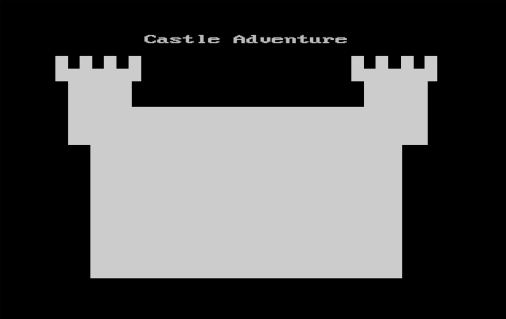

# Castle Adventure

Original Castle Adventure      |  J's Castle Adventure
:-------------------------:|:-------------------------:
  |  

##What is Castle Adventure?
- Castle Adventure is an old freeware/shareware DOS game. Built in 1984 by teenaged programmer Kevin Bales, it quickly spread. Today, it still occupies a place of fond nostalgia for many of us who started playing computer games in the DOS era, but has never been replicated fully for the modern internet browser.
- For more information, see [The Key to the Castle](http://www.thealmightyguru.com/Reviews/CastleAdventure/CA-TheGame.html)


##Technical Discussion
<dl>
<dt>HTML</dt>
<dd>The game makes heavy use of the HTML5 Canvas element - drawing on and manipulating it with Javascript functions.</dd>
<dt>CSS</dt>
<dd>There is a small amount of CSS that impacts gameplay - notably the blinking cursor by the user input.</dd>
<dt>JavaScript</dt>
<dd>I made use of JavaScript ES6 to build out the logic, display, and interaction behind the game.</dd>
</dl>

###Notes on Game Structure

The driving forces behind the game are three ES6 classes - `User`, `CanvasState`, and `Room`. `CanvasState` describes the state of the HTML5 canvas element; `User` contains the functions for moving, colliding, and switching between rooms; and `Room` takes both of those classes along with a room name to display the current room with the user's position and inventory on the screen. I think of it as a big funnel: all the pieces are dumped into the `Room` funnel and align to create what the user sees on the page.

Here's the beginning of `Room`'s constructor function as an example:

```javascript
class Room {
  constructor(canv, room, player) {
    for (let key in canv) { this[key] = canv[key]; }
    for (let attr in room) { this[attr] = room[attr]; } // looping through object passed
    this.ref = room; // need the room object in rooms.js to be accessible by this class and the User class in order to pick up objects
    this.drawWalls();
    this.player = player;
    /// other parameters & method calls
    }
  //// methods
}
```

## Opportunities for Further Growth

While the game as it currently is accomplishes the goals I wished to accomplish, there is, as always, room for growth.

### Fixing Known Glitches
- Font of some items is not the original font
- Player marker behavior on using stairs is a little buggy
- Room collision sound is delayed
- Win & lose screens won't display inventory
- Win & lose screens retain player position

### Cleaning Up Code
- Use `.hasOwnProperty()` for item interaction instead of having an excessive number of properties
- Revisit collision logic to see if it can be shortened... mostly it is the same function four different times, which seems like it can be done more efficiently.
- Consolidate some methods so my constructor functions aren't as long

## Future Stages of Development
#### Level 1
- Addition of "room flavor" - i.e. throne, bushes, shelves, etc.
- Addition of maze rooms
- Fairy and Vampire-type monsters

#### Level 2 
- Addition of ogres to fight... ogres will need their own initial-position and speed. 
- ***Fight-based loss scenario***
- Easter egg: keycode combo that will make the game imitate the original game's glitchy save patterns as seen [here](https://youtu.be/5ec6AbA-KSQ?t=7m15s). 

#### Level 3
- Expansion of game - up to 40 rooms
- Scoring system
- Adding a drop command and a max-length for the item inventory 

#### Level 4
- Exact, complete duplicate of original game
- Memory of high score

#### Level 5 _Castle's Sky_
- Generative version of the game - rooms are created on the fly without being specifically defined.

##Making Of Castle Adventure
<dl>
<dt>Author</dt>
<dd>J Silverstein</dd>
<dt>Credits</dt>